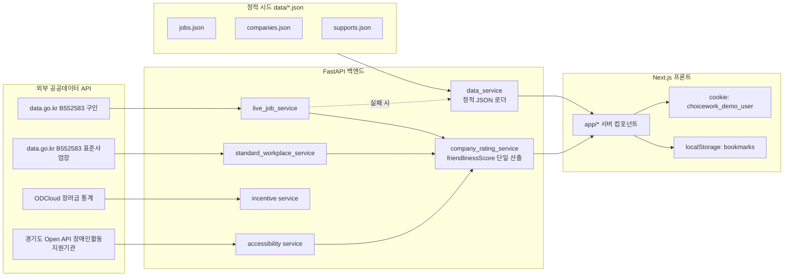
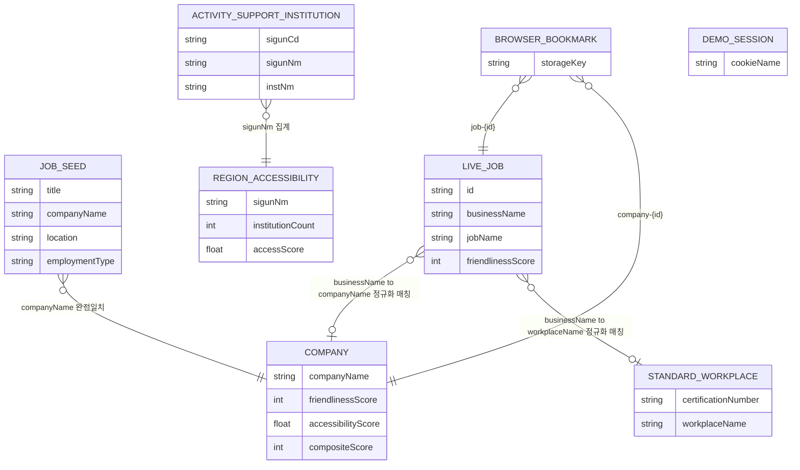

# 데이터 구조 및 ERD

작성일: 2026-08-17 (코드 기준 검증)

## 0. 먼저 밝혀둘 것 — 관계형 DB가 없다

ChoiceWork 백엔드(`backend/`)에는 SQLite/PostgreSQL 등 실제 데이터베이스가 없다. `requirements.txt`에 SQLAlchemy·DB 드라이버가 없고, `backend/app`에 `models/`나 `database.py`도 없다. 대신 다음 세 계층이 "데이터베이스" 역할을 나눠서 맡고 있다.

| 계층 | 실체 | 역할 |
|---|---|---|
| 정적 시드 | `data/*.json` (`jobs.json`, `companies.json`, `supports.json`) | 외부 API 실패 시 폴백(`source:"static"`) |
| 외부 공공데이터 API | data.go.kr(B552583 구인/장려금), ODCloud, 경기도 Open API | 실시간 소스(`source:"live"`) — 매 요청마다 백엔드가 프록시·가공 |
| 브라우저 localStorage | `bookmarks` 키, `choicework_demo_user` 쿠키 | 사용자별 상태(찜, 데모 로그인) — 서버에 저장되지 않음 |

이 문서의 "테이블"은 SQL 테이블이 아니라 **Pydantic 응답 스키마(`backend/app/schemas/*.py`)가 정의하는 데이터 계약**이다. 실질적으로 이 프로젝트의 데이터 모델 역할을 한다.

## 1. 데이터 흐름 개요

live 경로가 실패하면 백엔드/프론트가 정적 시드로 폴백하고 `source:"static"`을 태깅한다(`SourceBadge`로 프론트에 노출). `frontend/lib/kead-jobs.ts`는 백엔드를 거치지 않고 data.go.kr을 직접 호출하는 별도 병렬 경로로, 이 경로로 온 공고는 `friendlinessScore`가 없다(v2 기능 명세서 행 40 참고).

## 2. 엔티티(테이블) 기술서

### 2.1 Job — 정적 시드 공고 (`data/jobs.json`, `GET /jobs`)

| 필드 | 타입 | 필수 | 설명 |
|---|---|---|---|
| title | string | Y | 공고 제목 |
| companyName | string | Y | 기업명 — Company와의 조인 키 |
| location | string | Y | 근무지 (예: "서울") |
| employmentType | string | Y | 정규직/계약직/일용직 |
| accessibilityTags | string[] | Y | 접근성 태그 (예: "재택가능") |

`JobListResponse { source, syncedAt, data: Job[] }` — `source`는 이 라우트에서 항상 `"static"`.

### 2.2 LiveJob / LiveJobWithEnv — 실시간 구인 (`GET /jobs/live`, `/jobs/live-with-env`, `/jobs/live-merged`)

| 필드 | 타입 | 필수 | 설명 |
|---|---|---|---|
| id | string | live-merged만 | SHA-1(병합키)[:16] — Stable ID |
| recruitmentPeriod | string | | 모집 기간 |
| businessName | string | Y | 사업장명 — Company와의 조인 키(정규화 매칭) |
| contactNumber | string | | 연락처 |
| companyAddress | string | | 사업장 주소 |
| employmentType | string | | 고용형태 |
| entryType | string | | 입사구분 |
| jobName | string | Y | 직무명 |
| applicationDate | string | | 접수일 |
| registeredAt | string | | 등록일 |
| agencyName | string | | 관할 공단 지사 |
| requiredCareer / requiredEducation | string | | 경력/학력 요건 |
| salaryType / salary | string | | 급여 형태/금액 |
| envBothHands ~ envStndWalk | string | with-env만 | 근무환경 6축(양손·시력·손작업·중량물·청취대화·서기걷기) — 값 있는 축만 채워짐 |
| friendlinessScore | int | with-env/merged만 | `company_rating_service.compute_job_env_friendliness` 단일 산출값 |

**Stable ID 산출**(`backend/app/services/live_job_service.py`): `businessName·jobName·applicationDate·contactNumber·registeredAt·companyAddress`를 `|`로 이어 SHA-1 후 앞 16자. 응답 순서(index)에 의존하지 않아 재조회 시에도 동일 공고가 동일 id를 가진다.

`LiveJobMergedResponse`는 위 필드 + `meta`(requestedCount, collectedPages, mergeMatchRate 등 수집 품질 지표).

### 2.3 Company — 기업 친화도 (`data/companies.json` 정적 + 백엔드 산출, `GET /companies`)

| 필드 | 타입 | 필수 | 설명 |
|---|---|---|---|
| companyName | string | Y | 기업명 (PK 역할) |
| location | string | Y | 소재지 |
| disabledEmploymentRate | float | Y | 장애인 고용률 |
| retentionRate | float | Y | 근속·유지율(프록시) |
| jobDiversity | int | Y | 직무 다양성 지수 |
| friendlinessScore | int | Y | 0~100 종합 친화도 — **단일 진실 공급원, 프론트 재계산 없음** |
| accessibilityScore | float\|null | | 0~1 정규화, 경기도 활동지원기관 밀도 기반(GG_API_KEY 있을 때만) |
| compositeScore | int\|null | | `friendlinessScore*0.7 + accessibilityScore*0.3` |
| ratingBreakdown | dict\|null | | 아래 2.3.1 가중치 근거 |

#### 2.3.1 ratingBreakdown 가중치 (`company_rating_service.build_rating_methodology`)

| key | label | 비고 |
|---|---|---|
| employment | 장애인 고용률(정규화) | |
| retention | 근속·유지(프록시) | |
| jobDiversity | 직무 다양성 | |
| standardWorkplace | 표준사업장 인증 | 인증 시 100, 아니면 55 |
| workEnvironmentSixAvg | 근무환경 6축(공고 평균) | 매칭 공고 없으면 중립값 62 |
| welfare | 복지 프록시 | job_count/type_count 기반 |

가중치 실수(`WEIGHT_*`)는 `company_rating_service.py`에 정의, `GET /companies/rating-methodology`로 공개.

### 2.4 Support — 지원 제도 (`data/supports.json`, `GET /supports`)

| 필드 | 타입 | 설명 |
|---|---|---|
| supportName | string | 제도명 |
| target | string | 지원 대상 |
| amount | string | 지원 금액(안내용, 실지급액 아님) |
| description | string | 설명 |

### 2.5 RegionAccessibility / ActivitySupportInstitution — 경기도 활동지원 (`GET /accessibility`, `/accessibility/institutions`)

**RegionAccessibility**(시군 단위 집계)

| 필드 | 타입 | 설명 |
|---|---|---|
| sigunNm | string | 시군명 (PK) |
| institutionCount | int | 해당 시군 기관 수 |
| accessScore | float | institutionCount / maxCount 정규화(0~1) |

**ActivitySupportInstitution**(원본 row, 경기도 Open API 그대로 노출)

| 필드 | 타입 | 설명 |
|---|---|---|
| sigunCd / sigunNm | string | 시군 코드/명 — RegionAccessibility와의 조인 키 |
| instNm | string | 기관명 |
| actAsstnSalaryDivNm 등 3종 | string | 서비스 제공 여부 구분 |
| refineLotnoAddr / refineRoadnmAddr / refineZipCd | string | 주소 |
| refineWgs84Lat / refineWgs84Logt | string | 좌표 |
| telno / hmpgUrl | string | 연락처/홈페이지 |

### 2.6 IncentiveCompanyStat — 장려금 지원 사업체 통계 (`GET /incentives/live`)

| 필드 | 타입 | 설명 |
|---|---|---|
| year | int | 연도 |
| region | string | 지역 |
| industry | string | 업종 |
| businessCount | int | 사업체 수 |

### 2.7 StandardWorkplace — 표준사업장 인증 (`GET /standard-workplaces/live`)

| 필드 | 타입 | 설명 |
|---|---|---|
| certificationNumber | string | 인증번호 |
| certificationDate | string | 인증일 |
| businessRegistrationNumber | string | 사업자등록번호 |
| workplaceName | string | 사업장명 — Job/Company와의 조인 키(정규화 매칭) |
| address | string | 주소 |
| phoneNumber | string | 연락처 |

### 2.8 프론트 전용 상태 (서버 미저장)

| 저장소 | 키 | 값 | 설명 |
|---|---|---|---|
| localStorage | `bookmarks` | `string[]` | `job-{stableId}` 또는 `company-{id}` 형식 문자열 배열. `BookmarkButton`, `/saved-jobs`에서 사용 |
| cookie | `choicework_demo_user` | 세션 플래그 | `DEMO_USER`(`lib/demo-auth.ts`) — 실사용자 계정 아님, 발표용 데모 로그인만 표시 |

## 3. ERD (엔티티 관계)

관계형 FK 제약은 존재하지 않는다. 아래는 코드에서 실제로 사용하는 **텍스트 매칭 기반 조인 키**를 도식화한 것이다.

### 조인 키 상세

- **기업명 정규화**: `backend/app/services/company_name_normalize.py`의 `normalize_company_name_key()`가 구인 `businessName`, 표준사업장 `workplaceName`, 시드 `companyName`을 비교 가능한 키로 정규화한다(공백/법인 표기 차이 흡수). 완전 일치가 아니라 정규화 키 일치이므로, 표기가 크게 다른 기업은 매칭되지 않을 수 있다.
- **Stable ID**: `LIVE_JOB.id`는 DB PK가 아니라 공고 내용 해시(SHA-1[:16])다. `BROWSER_BOOKMARK.storageKey`가 이 id를 그대로 참조하므로, 공고 원문 필드(사업장명·직무명·접수일 등)가 바뀌면 다른 id가 되어 찜이 끊어질 수 있다(내용이 아예 동일해야 유지됨).
- **지역 조인**: `sigunNm`(문자열)이 사실상 유일한 지역 키이며 별도 지역 코드 테이블은 없다. `frontend/lib/job-regions.ts`가 프론트 쪽에서 별도로 `location` 문자열을 파싱해 시·도 키로 정규화하는데, 이는 백엔드 `sigunNm`과 독립적인 파서다.

## 4. 알려진 한계

- 모든 조인이 문자열 매칭(완전 일치 또는 정규화 매칭)이라 관계형 FK 무결성이 없다 — 기업명 표기가 다르면 조용히 매칭 실패한다.
- `Company`, `Job`, `Support`의 정적 시드(`data/*.json`)는 실제 스키마와 별개로 손으로 관리되는 파일이라, 필드 추가 시 스키마와 시드 파일을 각각 갱신해야 한다.
- 사용자 데이터(찜, 로그인)는 전부 브라우저에만 존재 — 기기를 바꾸거나 캐시를 지우면 사라진다. 서버 측 사용자 테이블은 없다.
